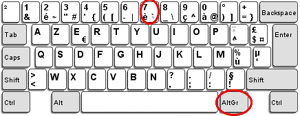
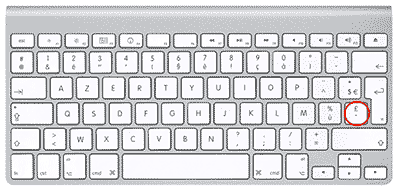

Sur Framateam, pour utiliser la coloration syntaxique, il faut :

1. Faire précéder son code par trois simples quotes suivi du nom du language ( ```php ).
2. Faire un retour à la ligne (MAJ + ENTREE)
3. Terminer son code par trois simples quotes (```)

---

### Utilisation des simples quotes:

* Sur un clavier PC il faut faire Alt GR + 7

 

* Sur un MAC il faut utiliser la touche « £ »

 